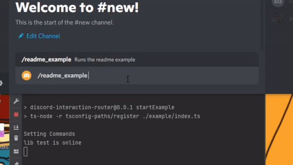

# Discord interaction router

⚠⚠⚠ This library is still in early development. Although it's fully working in its current state, it's not considered complete yet. ⚠⚠⚠

If you need help implementing this into your own project, be sure to check out the example project in `example`, or be free to open an issue on GitHub or email `mail@themimegas.com` with questions. If you have any feature requests or have any other suggestions (especially if they have to do with simplification of features), please do let me know. I'd like to aim towards perfecting this package and feedback is critical towards that goal.

This library aims to serve 2 purposes:

1. Easy stateful interaction groups. This useful for when you want to chain more than one interaction together and persist data between them.
2. Easy static interaction routing.

### The example bot

There is a complete discord bot project example under the `example` directory. If you'd like to run the bot on your system for test/demo purposes simply clone this repository, run `npm i`, set the environment var `TOKEN` to your discord bot's token with `export TOKEN=my-token`, then run it with `npm run startExample`. This example shows every feature this package has to offer in use with comments detailing what things do.

## Stateful interaction groups made easy

Create stateful grouped interactions/chat messages with ease. This makes multi question processes very easy to create. Stateful routes are stored in redis in order to allow you to scale/shard your bot with ease.

### How to integrate into an existing project basic example:

1. Create a redis router (you may also create an ExpiringInteractionRouter if you wish to not use redis.):
```ts
export const redisInteractionRouter = new RedisRouter("_redis_router_");
// Be sure to start the redis client also at the program start
await redisInteractionRouter.startRedis();
```

2. Pass incoming events into the redis router:
```ts
client.on("interactionCreate", async (interaction: Interaction) => {
  if (interaction instanceof MessageComponentInteraction || interaction instanceof ModalSubmitInteraction)
    await redisInteractionRouter.useInteractionRoute(client, interaction);
});
```

3. Create your interaction steps. This example shows chaining 3 interaction steps together. Take a second to look over it and read the comments, it may seem long at first but if you are already familiar with discord.js you should be able to get a good idea of what this code will do:
```ts
const signupFlow: interactionStepRoute.InteractionSteps = {
  // Define a command handler. This is only needed if you intend for this flow to be invoked by a command.
  // Each one of these functions is a single step
  commandHandler: async (context: interactionStepRoute.CommandContext): Promise<interactionStepRoute.StepResult> => {
    const row = new ActionRowBuilder<SelectMenuBuilder>()
      .addComponents(
        new SelectMenuBuilder()
          // The id for the next step is provided for you.
          .setCustomId(context.nextId)
          .setPlaceholder("Please select an option")
          .addOptions({label: "option 1", value: "1"}, {label: "option 2", value: "2"}, {label: "option 3", value: "3"})
      );

    await context.interaction.reply({content: "Select an option", components: [row]});
    // Mark step as completed. Tells the route to move on to expecting the next step
    return {success: true};
  },
  stepBranches: {
    "default": [
      async (context: interactionStepRoute.StepContext): Promise<interactionStepRoute.StepResult> => {
        // Narrow the incoming interaction type
        if (!(context.interaction instanceof SelectMenuInteraction))
          return {success: false};

        // Read and store data from the last interaction
        // Data stored in context.data is persisted between steps (must be json serializable)
        context.data["optionChosen"] = context.interaction.values[0];

        const row = new ActionRowBuilder<ButtonBuilder>()
          .addComponents(
            new ButtonBuilder()
              // Gets a custom id with an option number. This allows you to tell which button was pressed
              .setCustomId(context.getNextIdWithOption(1))
              .setLabel("Yes")
              .setStyle(ButtonStyle.Primary),
            new ButtonBuilder()
              .setCustomId(context.getNextIdWithOption(2))
              .setLabel("No")
              .setStyle(ButtonStyle.Secondary)
          );

        await context.interaction.reply({content: `You have slected option ${context.data.optionChosen}, would you like to continue?`, components: [row]});
        return {success: true};
      },
      async (context: interactionStepRoute.StepContext): Promise<interactionStepRoute.StepResult> => {
        if (!(context.interaction instanceof ButtonInteraction))
          return {success: false};

        // Check which button option was selected
        if (context.optionSelected === 1) {
          context.interaction.reply({content: "Recorded answer!"});
          console.log("Recorded data:");
          console.log(context.data);
          return {success: true};
        } else if (context.optionSelected === 2) {
          context.interaction.reply({content: "Did not record answer"});
          return {success: true};
        }
        return {success: false};
      }
    ]
  }
}

// Create a unique name for the class. Never name 2 classes the same thing.
const SignupFlow = interactionStepRoute.createRouteCls("signupFlow", signupFlow);
export default SignupFlow;
```

4. Register your interaction steps at program startup (skip this step if you're using the ExpiringInteractionRouter instead):
```ts
redisInteractionRouter.addRouteType(signupFlowCls);
```

5. Define a slash command that runs the following code, passing in the interaction object and client object:
```ts
const route = new SignupFlow();
await redisInteractionRouter.addRoute(route, {interaction, client});
```

And you're all done! If you followed along this should be your end product:


